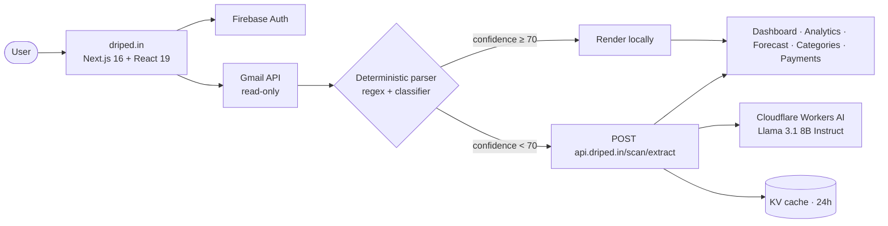

<!-- =====================================================================
     Driped — Stop the Drip · driped.in
     Subscription tracker that finds every recurring charge in your inbox.
     ===================================================================== -->

<div align="center">


# 💧 Driped &nbsp;·&nbsp; **Stop the Drip**

### Catch the drip. Cut the bills. <br/>Driped finds every recurring charge in your inbox and helps you cancel the ones you don't need.

<a href="https://driped.in"></a>
<a href="https://driped.in/download"></a>
<a href="https://driped.in/onboarding"></a>

<br />

<a href="https://github.com/Abhinavv-007/DRIPED-Web/stargazers"></a>
<a href="https://github.com/Abhinavv-007/DRIPED-Web/commits/main"></a>


<br/>

<sub>Stop letting subscriptions <i>drip</i> out of your account. Driped catches them, lines them up, and lets you axe the ones you forgot about.</sub>

</div>

<br/>

---

## ✦ The Drip Problem

> The average person leaks **$220+/year** to forgotten subscriptions — old streaming services, apps you tried once, free trials that quietly turned paid. Driped scans your inbox, recognises the recurring charges, normalises the amounts/cycles/merchants, and gives you a single command center to track and cancel them.

<table>
  <tr>
    <td width="50%" valign="top">
      <h3>📥 Connect your inbox</h3>
      <p>OAuth into Gmail (read-only scope). Driped pulls billing-style emails and runs them through a deterministic parser that handles ~85% of merchants on its own — sender-domain map, regex templates, classifier, amount/date/cycle extractors.</p>
    </td>
    <td width="50%" valign="top">
      <h3>🤖 AI fallback for the rest</h3>
      <p>Low-confidence or unknown-sender emails fall through to a cloud Llama&nbsp;3.1 8B Instruct worker on Cloudflare Workers AI. Sanitised body slices only. Cached per-email for 24 h. Rate-limited.</p>
    </td>
  </tr>
  <tr>
    <td width="50%" valign="top">
      <h3>📊 See every charge</h3>
      <p>Dashboard, analytics, forecast, categories, payments, savings, profile — every recurring expense lined up by next charge date. Sortable, filterable, time-traveled monthly views.</p>
    </td>
    <td width="50%" valign="top">
      <h3>🪓 Cancel the drip</h3>
      <p>One-tap "Cancel this" links straight to the merchant's cancellation page where it exists, plus a curated "how to cancel" guide for the trickier ones.</p>
    </td>
  </tr>
  <tr>
    <td width="50%" valign="top">
      <h3>🔐 Privacy first</h3>
      <p>Read-only Gmail scope. Email contents leave the device only when on-device parsing returns <code>overallConfidence&nbsp;&lt;&nbsp;70</code>. Even then, only a sanitised slice is sent. No per-user audit log retained.</p>
    </td>
    <td width="50%" valign="top">
      <h3>🌗 Light + dark, every screen</h3>
      <p>Built with Next.js 16 + React 19 + Radix + shadcn + Tailwind 4. Theme persists across devices via Zustand storage. Cinematic motion via Framer.</p>
    </td>
  </tr>
</table>

---

## ✦ Architecture



---

## ✦ Surfaces

| Route | Purpose |
| --- | --- |
| `/` | Marketing + dashboard entry |
| `/onboarding` | Inbox connect, scan progress, first-run wizard |
| `/connect` | Gmail OAuth handoff |
| `/(dashboard)/analytics` | Charts of monthly spend, category split |
| `/(dashboard)/categories` | Browse subscriptions by category |
| `/(dashboard)/forecast` | Cashflow forecast for the next 12 months |
| `/(dashboard)/payments` | Upcoming charges by date |
| `/(dashboard)/savings` | What you've saved by cancelling |
| `/(dashboard)/profile` | Account, plan, theme |
| `/(dashboard)/subscriptions` | Master list of every detected subscription |
| `/download` | Get the Driped Android app |

---

## ✦ Tech Stack

<p>
  
  
  
  
  <br/>
  
  
  
  
  <br/>
  
  
  
  
  
</p>

---

## ✦ Local Dev

```bash
git clone https://github.com/Abhinavv-007/DRIPED-Web.git
cd DRIPED-Web
npm install

# Copy and fill in the environment
cp .env.example .env.local

npm run dev           # http://localhost:3000
```

Lint:

```bash
npm run lint
```

Build (webpack):

```bash
npm run build
npm run start
```

Deploy to **Cloudflare Workers** (via OpenNext):

```bash
# wrangler is already a dev dep
npx wrangler --version
# build + deploy through @opennextjs/cloudflare per your routing config
```

---

## ✦ Project Layout

```text
DRIPED-Web/
├── src/
│   ├── app/
│   │   ├── (dashboard)/{analytics,categories,forecast,payments,profile,savings,subscriptions}
│   │   ├── connect/        # Gmail OAuth handoff
│   │   ├── onboarding/     # First-run scan wizard
│   │   ├── download/       # App download landing
│   │   ├── layout.tsx, page.tsx, globals.css
│   │   ├── icon.png, apple-icon.png, opengraph-image.png
│   ├── components/
│   │   ├── auth-gate.tsx, providers.tsx
│   │   ├── dashboard/, subscriptions/, shared/, ui/
│   └── lib/                # stores, helpers, parser glue
├── public/                 # driped-mark.png, brand-icons/* (per-merchant logos)
├── next.config.ts, tsconfig.json, eslint.config.mjs
└── components.json         # shadcn config
```

---

## ✦ The Mail Pipeline

> Two tiers, in order. Tier 1 wins ~85% of the time and stays on-device. Tier 2 only sees a sanitised slice.

| Tier | What runs | Where | Notes |
| --- | --- | --- | --- |
| 1 | `SubscriptionParser` + `@driped/scan` | On-device | Sender-domain map, merchant regex templates, classifier, amount / date / cycle extractors |
| 2 | Llama 3.1 8B Instruct via Cloudflare Workers AI | `POST https://api.driped.in/scan/extract` | Cached per-email in KV for 24 h. Rate-limited to **100 extractions / user / minute** |

Privacy guarantees:
- Email contents leave the device **only** when tier 1 returns `overallConfidence < 70`.
- Even then, only a sanitised body slice is sent.
- The Worker keeps **no per-user audit log**.

---

## ✦ Status & Versioning

| | |
|---|---|
| Production | [`driped.in`](https://driped.in) |
| Latest web release |  |
| Web build | webpack via `next build --webpack` |
| Mobile companion | [DRIPED-Android](https://github.com/Abhinavv-007/DRIPED-Android) |

---

## ✦ Star History

<a href="https://star-history.com/#Abhinavv-007/DRIPED-Web&Date">
  
</a>

---

<div align="center">
  <sub>💧 Built by <a href="https://abhnv.in"><b>Abhinav Raj</b></a> — stop the drip.</sub>
  <br/>
  <a href="https://abhnv.in">Portfolio</a> · <a href="https://www.linkedin.com/in/abhnv07/">LinkedIn</a> · <a href="https://x.com/Abhnv007">X</a> · <a href="https://www.instagram.com/abhinavv.007/">Instagram</a>
</div>
